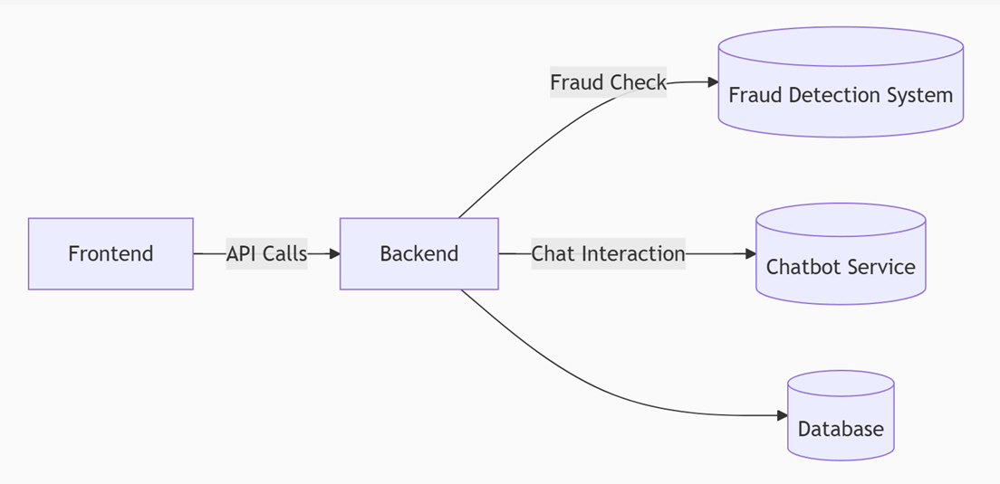

# 🛡️ cap-fraud — Fraud Detection API

This is the backend service used in the [`ce-grp-3a` e-commerce website project](http://ce-grp-3a-my-app2.sctp-sandbox.com/) to test communication with frontend (website) before actual integration to fraud detection and chatbot services.

It provides a REST API endpoint to receive and send back the text from frontend. 
It is to test the comm between frontend and backend of http://ce-grp-3a-my-app2.sctp-sandbox.com/ after text is entered at textbox and "Send to Fraud Detection" is clicked

---

## 📦 Prerequisites

- **Node.js** (v16 or newer)
- **npm** (comes with Node.js)
- **Git**

---

## 🚀 Getting Started (Local)

### install dependencies
after git clone, go to the git cloned folder and perform
   npm install 

### build and push image to your docker hub
docker build -t `<dockerhub-username>`/fraud-service:v1.0.1 .

docker push `<dockerhub-username>`/fraud-service:v1.0.1

A new version has to be used everytime the image is updated. eg. v1.0.2

### effect the image for deployment 
Update the version number (eg. v.1.0.1) in previous step to backend-deploy.yaml that cloned from [sctp-cap-webCD repo](https://github.com/joseph03/sctp-cap-webCD)

then git push to sctp-cap-webCD repo and perform
argocd app sync my-app2  --prune
so that Argocd server can run image v1.0.1 in http://ce-grp-3a-my-app2.sctp-sandbox.com/
 